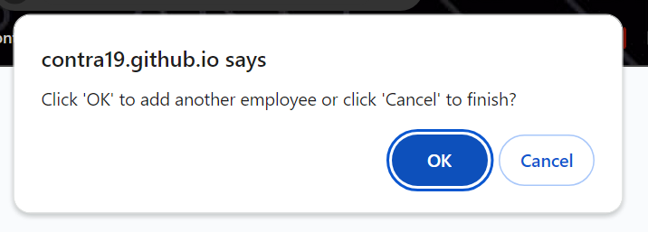

# Employee Payroll Tracker

## A web application to track employee name's and salaries 

## Description

The Employee Payroll Tracker is a fun novelty web application that is used to track employee names and salaries. The names will remain saved in memory and on screen until the page refreshes as this is not intended to be used as a persistent tracker. 

The application is built using HTML, CSS and JavaScript. The majority of the code is in JavaScript. JavaScript was the main focus in this application as this is a project to practice JavaScript for a class that I am taking. Our goal was to correct code and make the application functional.  

## Useage

The Employee Payroll Tracker does not need to be installed and can be found at https://contra19.github.io/payroll-tracker/. Once on the page the application is ready to use. 

When entering the app the user is presented with a blank employee roster and and "Add Employees" button. 

The user will click the "Add Employees" button and will be prompted to add information for each employee.

Once the button is clicked, the user is presented with a prompt box that will ask for the employee's first name. To record the data, the user will need to either click 'OK' or press 'ENTER'.

After entering the employee's first name the user will get another prompt box asking for last name. After entering the last name the last prompt box will ask for the user salary. The final prompt will ask the user if they would like to add another employee. The user can add another employee by clicking on 'OK' or stop adding employee's by clicking 'Cancel'

The user can continue to add as many employees as they wish. Once finished entering users the user will see a list of employess sorted alphabetically by last name. 

Some functional decisions I made for specific user actions are:
- If the user enters a first name or last name that is not capitalized, the application will automatically capitalize the first letter of the name. 
- If a blank first name and blank last name are provided for the same employee, the employee WILL NOT be recorded. 
- If a non-numeric salary or a blank salary are entered the application will convert the salary to a 0 value.

Easter Eggs
Some Easter Eggs that you will be able to find when you open the browser console:
- Average employee salary is calculated
- A message about our random drawing winner!

## Credits
Since this was a project for class, starter code was provided by Xander Rapstein(Xandromus) at https://github.com/coding-boot-camp/curly-potato. This code was used as the primer to get the framework of this project in place. Only the JavaScript code was altered. No changes were made to the HTML or CSS files. 

All original code was written under the collectEmployees, displayAverageSalary and getRandomEmployees functions. These functions were generated by looking at example code for the concepts used. The code was run through AI(chatGPT) to validate.  

## License
The MIT License

Copyright (c) 2024 Robert Wisniewski

Permission is hereby granted, free of charge, to any person obtaining a copy of this software and associated documentation files (the "Software"), to deal in the Software without restriction, including without limitation the rights to use, copy, modify, merge, publish, distribute, sublicense, and/or sell copies of the Software, and to permit persons to whom the Software is furnished to do so, subject to the following conditions:

The above copyright notice and this permission notice shall be included in all copies or substantial portions of the Software.

THE SOFTWARE IS PROVIDED "AS IS", WITHOUT WARRANTY OF ANY KIND, EXPRESS OR IMPLIED, INCLUDING BUT NOT LIMITED TO THE WARRANTIES OF MERCHANTABILITY, FITNESS FOR A PARTICULAR PURPOSE AND NONINFRINGEMENT. IN NO EVENT SHALL THE AUTHORS OR COPYRIGHT HOLDERS BE LIABLE FOR ANY CLAIM, DAMAGES OR OTHER LIABILITY, WHETHER IN AN ACTION OF CONTRACT, TORT OR OTHERWISE, ARISING FROM, OUT OF OR IN CONNECTION WITH THE SOFTWARE OR THE USE OR OTHER DEALINGS IN THE SOFTWARE.
